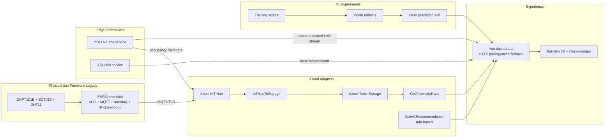
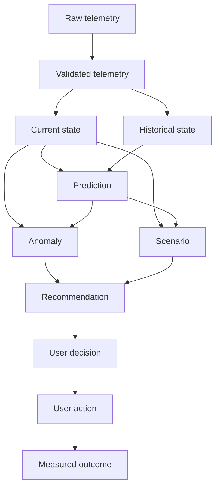
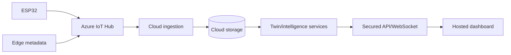
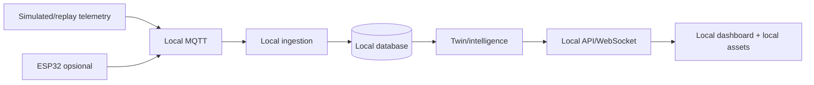

# System Architecture — Twinuvo AI

## Status dokumen

Versi 0.1.0, snapshot 2026-08-03. Diagram **aktual** berasal dari source yang ditemukan; diagram **target** adalah keputusan arah dan tidak menyatakan implementasi selesai.

## Prinsip

1. Satu ruangan aktif untuk MVP; `buildingId`/`roomId` tetap eksplisit agar dapat berkembang.
2. Measurement-only pada perangkat listrik; tidak ada switching/kontrol AC otomatis.
3. Raw input tidak langsung menjadi Twin State: validasi, normalisasi, quality, dan ordering wajib.
4. Cloud dan local mode menggunakan kontrak domain yang sama.
5. Kamera diproses di edge; hanya metadata agregat keluar dari Raspberry Pi.
6. Semua prediksi, anomali, scenario, dan recommendation memiliki version/evidence/status.
7. Target dan hasil aktual selalu dipisahkan.

## Arsitektur aktual



### Keterbatasan aktual

- Firmware belum menggunakan PZEM dan payload belum versioned/room-scoped.
- Jalur IR closed-loop bertentangan dengan scope MVP.
- Ingestion belum memiliki schema validation, deduplication, dead-letter, atau audit formal.
- Presentation state dashboard bukan Twin State domain.
- Forecast experiment belum memprediksi horizon 30/60 menit dengan time-based split.
- Dua service occupancy belum memiliki keputusan canonical dan stream raw belum secure-by-default.
- Local mode belum menyediakan broker/backend/database/replay stack lengkap.

## Arsitektur target logis

```mermaid
flowchart LR
    LOAD[Perangkat listrik\nsatu ruangan] --> PZEM[PZEM-004T V3.0]
    ENV[Sensor suhu/kelembapan] --> ESP[ESP32 energy node]
    PZEM -->|UART + PZEM004Tv30| ESP
    ESP -->|versioned telemetry| COMM[MQTT atau API adapter]

    CAMERA[Kamera opsional] --> EDGE[Edge occupancy AI\nRaspberry Pi]
    EDGE -->|count + confidence + IDs + modelVersion| COMM

    COMM --> ING[Ingestion Service]
    ING --> VALIDATE[Validate + normalize + deduplicate]
    VALIDATE --> RAW[(Raw/validated time-series)]
    VALIDATE --> TWIN[Twin State Engine]
    RAW --> TWIN

    TWIN --> PRED[Prediction Engine]
    TWIN --> ANOM[Anomaly Engine]
    PRED --> ANOM
    TWIN --> SCENARIO[Scenario Engine]
    PRED --> SCENARIO
    ANOM --> DECISION[Decision Engine]
    SCENARIO --> DECISION
    DECISION --> API[Backend API/WebSocket]
    TWIN --> API
    API --> DASH[Dashboard + rumah 3D]
    DASH --> HUMAN[Human review\naccept/reject]
    HUMAN --> FEEDBACK[Decision/outcome log]
    FEEDBACK --> TWIN
```



## Komponen target

| Komponen | Tanggung jawab | Input | Output | Status |
|---|---|---|---|---|
| ESP32 energy node | Baca sensor, quality, buffer/publish | PZEM + environment | Telemetry v1 | `PLANNED` untuk PZEM |
| Occupancy edge | Detection/tracking dan aggregation lokal | Frame lokal | Occupancy metadata | `PARTIALLY_IMPLEMENTED` |
| Communication adapter | MQTT/API transport tanpa domain mutation | Versioned messages | Delivery event | `PARTIALLY_IMPLEMENTED` |
| Ingestion service | Auth device, validate, normalize, dedup | Raw messages | Validated/rejected event | `PARTIALLY_IMPLEMENTED` |
| Time-series storage | Raw, validated, current/history retention | Validated event | Queryable history | `PARTIALLY_IMPLEMENTED` |
| Twin State Engine | State per room dan quality/staleness | Validated + derived events | Current/historical Twin State | `PLANNED` |
| Prediction Engine | Forecast 30/60 + uncertainty/version | Historical Twin State | Prediction entity | `PARTIALLY_IMPLEMENTED` |
| Anomaly Engine | Rules/statistics/residual detection | State + prediction | Anomaly entity | `PARTIALLY_IMPLEMENTED` |
| Scenario Engine | Baseline vs alternative simulation | State + prediction + assumption | Scenario result | `PLANNED` |
| Decision Engine | Recommendation + evidence/lifecycle | State/anomaly/scenario | Recommendation entity | `PARTIALLY_IMPLEMENTED` |
| Feedback loop | User decision dan measured outcome | Recommendation + user action | Audit/outcome event | `PLANNED` |
| Backend API | AuthZ/query/subscription | Domain queries/commands | HTTP/WebSocket contract | `PARTIALLY_IMPLEMENTED` |
| Dashboard | Monitoring, 3D, review, explicit data source | API events | User interaction | `PARTIALLY_IMPLEMENTED` |

## Twin State boundaries



Setiap entity wajib memuat `schemaVersion`, entity ID, `buildingId`, `roomId`, timestamp UTC, quality/status, dan version sumber/model bila relevan. Raw input tidak boleh ditimpa oleh derived result.

## Cloud mode



Azure IoT Hub/Table/Functions saat ini adalah adapter legacy yang dapat dipertahankan selama contract target diterapkan. Deployment cloud baru dianggap terverifikasi setelah E2E test dengan identity, schema, retention, dan observability.

## Local/offline competition mode



Required environment baseline:

```dotenv
APP_MODE=local
DEMO_MODE=true
REPLAY_MODE=false
```

Local mode tidak boleh memerlukan font, tile, model, auth, registry, atau API internet saat demo berjalan. Replay harus menyertakan urutan normal → increase → prediction → anomaly → scenario → recommendation → accept/reject → outcome → 3D state.

## Security dan trust boundaries

- Device/edge identity berakhir di ingestion; shared write key tidak boleh berada di browser.
- Backend memvalidasi schema, ukuran, range, timestamp, identity-to-room mapping, dan idempotency.
- Dashboard memakai user identity dan role server-side; frontend variable bukan secret.
- Camera raw stream default off atau hanya pada jaringan/auth terkontrol; cloud menerima metadata agregat.
- Model artifact hanya dimuat dari sumber tepercaya setelah hash/signature diverifikasi.
- Log menyingkirkan secret, raw frame, dan payload sensitif; event penting memiliki correlation/message ID.

## Error handling dan resilience

| Failure | Perilaku target |
|---|---|
| PZEM/sensor timeout | Nilai absent/last-known terlabel stale; quality invalid; tidak membuat dummy actual |
| MQTT/API putus | Retry exponential bounded + local buffer; duplicate aman melalui message ID |
| Pesan invalid/out-of-order | Reject/quarantine dengan alasan; current state tidak mundur |
| Storage unavailable | Backpressure/buffer; health degraded; tidak kehilangan error |
| Model unavailable | Baseline/fallback terlabel jelas; tidak disebut ML aktual |
| Cloud unavailable | Local mode/replay tetap berfungsi |
| Recommendation expired | Tidak dapat dieksekusi; status `expired` |

## Scalability path

MVP tetap single-room secara produk, tetapi contract menggunakan `buildingId`/`roomId`/`deviceId`; storage partition tidak boleh hardcoded ke satu device; state engine diisolasi per room; consumer harus idempotent. Multi-room baru dimulai setelah single-room correctness, privacy, load, dan tenancy model diuji.

## Deployment constraints

- Monorepo dipertahankan sementara; perpindahan file mengikuti [Migration Map](../audit/MIGRATION_MAP.md).
- Cloud dan local deployment harus memisahkan config dari source serta menggunakan `.env.example` yang hanya berisi placeholder.
- Tidak ada database migration, credential rotation, file removal, atau history rewrite pada checkpoint arsitektur ini.
