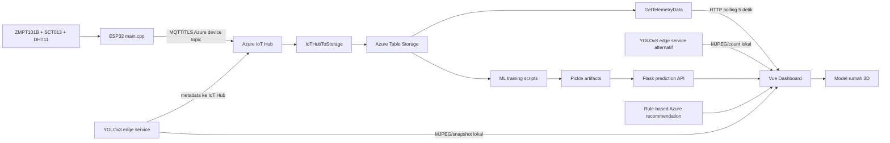

# Repository Audit — Twinuvo AI

## Metadata

| Field | Nilai |
|---|---|
| Tanggal snapshot | 2026-08-03 |
| Repository aktual | `dashboard_digitaltwin-3` |
| Nama produk target | Twinuvo AI |
| Tahap | Phase 0 — Audit dan keselamatan |
| Sifat audit | Read-only terhadap kode lama; hanya menambah dokumentasi |
| Git snapshot | 794 file terlacak sebelum dokumen audit ditambahkan |

## Ruang lingkup dan metode

Audit mencakup source C++ ESP32, Python ML/edge, Vue, Azure Functions, konfigurasi, dependency manifest, test, CI, deployment descriptor, dokumentasi, file besar, artefak model, pola credential, nama TwinSpace, sensor legacy, endpoint, serta ID perangkat/ruangan. Bukti diperoleh melalui inventaris Git, pencarian referensi, pembacaan source, build/test lokal, Python bytecode compilation, dan pemindaian pola secret dengan nilai disensor.

Keterbatasan:

- Perangkat ESP32, PZEM, kamera, Raspberry Pi, Azure, dan MQTT tidak tersedia untuk uji end-to-end.
- PlatformIO, Azure CLI, Azure Functions Core Tools, Gitleaks, dan `pip-audit` tidak tersedia.
- `npm audit` ke registry resmi mengalami timeout, sehingga status vulnerability dependency belum dapat dinyatakan bersih.
- Pemindaian riwayat Git berbasis pola dilakukan secara terbatas; audit forensik penuh tetap diperlukan.

## Kondisi Git awal

Worktree sudah memiliki perubahan pengguna pada konfigurasi ignore, ML API/training, edge camera, tiga Azure Function, beberapa composable dashboard, konfigurasi frontend, dan `CesiumViewer.vue`. Terdapat pula file lokal belum terlacak termasuk catatan endpoint, tile server, MBTiles, screenshot, dan konfigurasi `.claude`. Audit tidak menimpa perubahan tersebut.

## Struktur aktual

```text
dashboard_digitaltwin-3/
├── view_virtual/                 # Vue 3 dashboard + Babylon/Cesium/maps
├── sensor iot/
│   ├── src/main.cpp              # Monolit firmware ESP32
│   ├── raspberry-pi/             # YOLOv3-tiny edge service
│   └── azure-setup/              # Azure Functions dan deployment scripts
├── raspberry_pi/                 # YOLOv8 camera service kedua
├── ml_models/                    # Training, inference API, dan pickle artifacts
├── docs/reports/                 # Dua laporan lama
├── local_data/                   # Placeholder Azurite
├── .github/workflows/ci.yml      # CI parsial
├── azure-pipelines.yml           # Pipeline root yang tidak selaras
└── README.md                     # README TwinSpace yang tidak lagi akurat
```

File terlacak didominasi aset vendor/build:

| Kelompok | Jumlah terlacak | Catatan |
|---|---:|---|
| `view_virtual/public/cesium/**` | 326 | Bundle vendor besar, duplikasi dependency npm |
| `sensor iot/.cache/**` | 290 | Cache indeks clangd; artefak lokal |
| `ml_models/models/*.pkl` | 6 | Artefak pickle tanpa hash/model card |

## Arsitektur aktual yang ditemukan



Belum ada service formal untuk validation, Twin State, forecast 30/60 menit, scenario, decision lifecycle, feedback/outcome, schema registry, atau offline stack lengkap.

## Temuan utama

### P0 — keselamatan dan keamanan

1. Credential yang tampak aktif ditemukan pada file lokal belum terlacak dan pada konfigurasi contoh terlacak. Nilai tidak dicantumkan di dokumen ini. Rotasi dan audit riwayat diperlukan.
2. Frontend memuat token/key write dan opsi password admin melalui variabel `VITE_*`; semua nilai tersebut menjadi bagian bundle browser dan tidak boleh diperlakukan sebagai secret.
3. Firmware berisi closed-loop yang dapat mengirim perintah IR AC otomatis. Ini bertentangan dengan MVP human-in-the-loop dan non-goal kontrol otomatis.
4. Dokumen status Raspberry Pi terlacak berisi password SSH yang tampak nyata.
5. Belum ada PZEM-004T atau `PZEM004Tv30`; firmware aktif masih membaca ZMPT101B/SCT013 via ADC dan menghitung daya secara manual.

### P1 — integritas produk

1. Klaim “energy forecast” tidak memprediksi horizon waktu; target adalah nilai `daya` pada sampel yang sama dan split dilakukan secara acak.
2. Label rekomendasi AC dibuat dari formula internal, bukan feedback pengguna atau outcome aktual. Nilai R² tidak membuktikan penghematan/kenyamanan.
3. Azure Functions belum memiliki schema validation, rate limiting, audit trail, deduplication, room scoping, atau test otomatis.
4. Dashboard production build gagal karena `AdminDashboard.vue` kosong.
5. README menyebut file/service yang tidak ada dan menyatakan CI/deployment lebih lengkap daripada implementasi.
6. Camera stream dan snapshot tersedia tanpa autentikasi dengan CORS luas; frame tidak disimpan ke disk tetapi dapat diakses jaringan.

### P2 — maintainability

1. Firmware `main.cpp` sekitar 80 KB menggabungkan sensor, TLS, SAS, MQTT, anomaly, IR capture, dan closed-loop control.
2. Dua implementasi camera/YOLO berbeda belum memiliki keputusan canonical.
3. Cache clangd, compile database absolut, bundle Cesium, dan model pickle terlacak.
4. Banyak endpoint, device ID, lokasi, timezone, dan room semantics hardcoded.
5. Encoding mojibake tersebar dalam README, source log, dan dokumen.
6. `local_tileserver.py` menunjuk MBTiles satu direktori di atas lokasi file aktual.

## Inventaris teknologi aktual

| Area | Teknologi | Status audit |
|---|---|---|
| Firmware | ESP32 Arduino/PlatformIO, DHT11, PubSubClient, ArduinoJson, IRremoteESP8266 | `IMPLEMENTED_NOT_VERIFIED` |
| Meter listrik target | PZEM-004T V3.0 + PZEM004Tv30 | `PLANNED` |
| Edge AI | OpenCV YOLOv3-tiny dan Ultralytics YOLOv8 | `IMPLEMENTED_NOT_VERIFIED` |
| Cloud ingestion | Azure IoT Hub, Event Hub trigger, Azure Functions | `IMPLEMENTED_NOT_VERIFIED` |
| Storage | Azure Table Storage | `IMPLEMENTED_NOT_VERIFIED` |
| Dashboard | Vue 3, Chart.js, Babylon.js, Cesium/MapLibre/Leaflet | `PARTIALLY_IMPLEMENTED` |
| Authentication | Firebase + local frontend fallback | `PARTIALLY_IMPLEMENTED` |
| ML | scikit-learn RandomForest/GradientBoosting + Flask | `PARTIALLY_IMPLEMENTED` |
| Tests | 113 frontend test cases | `IMPLEMENTED_AND_VERIFIED` untuk unit test frontend saja |
| CI/CD | GitHub Actions + Azure Pipeline parsial | `PARTIALLY_IMPLEMENTED` |

## File disebut tetapi tidak tersedia

- `LICENSE`, `CHANGELOG.md`, `CONTRIBUTING.md`, `SECURITY.md`
- `docs/planning/*`, sebagian laporan yang ditautkan README
- `scripts/generate_sample_data.js`, `scripts/check_storage_data.js`, `scripts/export_sensor_data.js`
- `view_virtual/src/composables/useMQTT.js`
- `raspberry_pi/local_api.py` dan `raspberry_pi/camera_stream_server.py`
- replay dataset dan local/offline orchestration

## Keputusan audit sensor legacy

| Komponen | Lokasi | Klasifikasi | Alasan |
|---|---|---|---|
| ZMPT101B | firmware, dashboard, README, report | `AKAN_DIMIGRASIKAN` | Masih menjadi implementasi listrik aktual |
| SCT013 | firmware, dashboard, README, report | `AKAN_DIMIGRASIKAN` | Masih menjadi implementasi listrik aktual |
| ADC voltage/current | `sensor iot/src/main.cpp` | `LEGACY` | Tidak sesuai target PZEM, belum aman dihapus |
| Perhitungan `V × I` | firmware/frontend | `LEGACY` | Bukan active power PZEM; perlu transisi contract |
| PZEM-004T V3.0 | tidak ditemukan | `PLANNED` | Belum ada dependency, source, wiring, atau test |

## Kesimpulan

Repository menunjukkan prototipe nyata pada dashboard, cloud adapter, ML experiment, firmware legacy, dan edge camera. Namun belum dapat disebut Twinuvo AI competition-ready. Baseline aman adalah mempertahankan monorepo, membekukan klaim yang belum diuji, merotasi secret, menonaktifkan kontrol otomatis untuk MVP, membuat schema kontrak, lalu memigrasikan sensing ke PZEM sebelum membangun Twin State dan intelligence layer.
