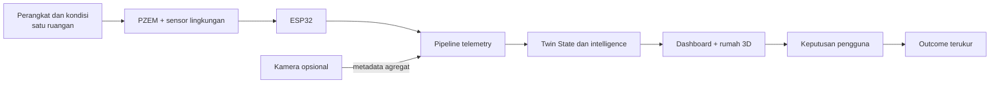

# Product Scope — Twinuvo AI

## Pernyataan ruang lingkup

Twinuvo AI adalah **Decision Support System** berbasis Digital Twin untuk satu ruang hunian aktif yang ditampilkan di dalam konteks model rumah 3D. Prototipe saat ini belum memonitor seluruh rumah. Keputusan operasional tetap berada pada pengguna melalui mekanisme human-in-the-loop.

## In scope untuk MVP kompetisi

- Satu `buildingId`, satu `roomId` aktif, dan satu atau lebih perangkat yang dipetakan ke ruangan tersebut.
- Pengukuran tegangan, arus, daya aktif, energi aktif, frekuensi, dan faktor daya menggunakan PZEM-004T V3.0.
- Pengukuran suhu dan kelembapan melalui sensor lingkungan pada ESP32.
- Pengiriman, validasi, normalisasi, dan penyimpanan telemetry versioned.
- Current Twin State, historical state, quality status, dan status konektivitas.
- Dashboard real-time, grafik historis, dan model rumah 3D dengan satu ruangan aktif.
- Forecast daya/energi 30 dan 60 menit setelah tersedia data dan evaluasi yang memadai.
- Deteksi anomali, scenario what-if, rekomendasi, persetujuan pengguna, dan pencatatan outcome.
- Cloud mode serta local/offline competition mode dengan replay deterministik.
- Occupancy estimation opsional di Raspberry Pi; hanya metadata agregat yang keluar dari edge.

## Out of scope untuk MVP

- Klaim bahwa seluruh rumah merupakan Digital Twin aktif.
- Kontrol otomatis AC, lampu, stopkontak, atau switching listrik AC.
- Penyimpanan atau pengiriman video/frame mentah ke cloud.
- Simulasi fisika bangunan penuh.
- Klaim penghematan, akurasi, uptime, atau usability tanpa hasil pengujian.
- Multi-room production deployment, aplikasi mobile, integrasi renewable energy, dan kontrol perangkat otomatis.

## Batas sistem

Bagian rumah di luar ruang aktif hanya menyediakan konteks spasial pada model 3D. Kamera, jika digunakan, berada di batas edge dan tidak menjadi sumber video cloud.

## Status baseline 2026-08-03

| Area | Status | Keterangan |
|---|---|---|
| Dashboard dan chart | `PARTIALLY_IMPLEMENTED` | Unit test lulus; build production masih gagal |
| Firmware sensor lingkungan | `IMPLEMENTED_NOT_VERIFIED` | Belum diuji pada hardware dalam audit |
| PZEM-004T V3.0 | `PLANNED` | Firmware masih memakai sensor listrik legacy |
| Cloud ingestion/storage | `IMPLEMENTED_NOT_VERIFIED` | Kode tersedia; E2E cloud belum dibuktikan |
| Twin State formal | `PLANNED` | Belum ada domain engine/schema |
| Forecast 30/60 menit | `PARTIALLY_IMPLEMENTED` | Eksperimen saat ini bukan forecast horizon tervalidasi |
| Local/offline stack | `PARTIALLY_IMPLEMENTED` | Cache/tile prototype ada; stack lengkap belum ada |
| Human-in-the-loop | `PARTIALLY_IMPLEMENTED` | UI ada, lifecycle dan outcome belum persisten |

Sumber status terperinci: [Feature Inventory](../audit/FEATURE_INVENTORY.md).
